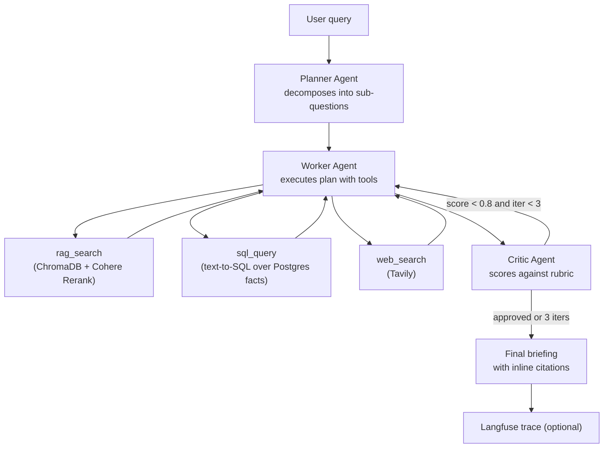

# Agentic Research Assistant

Production-grade multi-agent research system built on **LangGraph**.
A Planner / Worker / Critic loop with RAG, SQL, and web-search tools, optional
Langfuse observability, and a Ragas eval suite.

[Live demo](https://your-demo-url) - [Langfuse traces](https://your-langfuse-dashboard) - [60s Loom](https://loom-url)

## What it does

Given any research question over the indexed corpus, it:

1. **Plans** sub-questions and routes each to the right tool.
2. **Executes** with RAG (ChromaDB + Cohere Rerank), SQL (Postgres), or web (Tavily).
3. **Critiques** the draft against a faithfulness / citation / completeness rubric and loops up to 3x if quality is low.

## Architecture



## Quickstart

```bash
cp .env.example .env          # fill in your API keys
docker compose up --build     # starts Postgres + the Streamlit app
make ingest                   # index data/corpus into ChromaDB
make seed                     # load data/facts.csv into Postgres
# open http://localhost:8501
```

Local (without Docker):

```bash
python -m venv .venv && source .venv/bin/activate
make install
make download    # optional: pull the SR papers listed in the manifest
make ingest
make seed
make run
```

## Eval results

Run `make eval` to generate scores against the 10-question set in
`evals/eval_set.json`, then paste your actual numbers here:

| Metric | Score |
|---|---|
| Faithfulness | _run `make eval`_ |
| Answer Relevancy | _run `make eval`_ |
| Context Precision | _run `make eval`_ |

## Tech stack

LangGraph - LangChain - OpenAI - Cohere Rerank - ChromaDB - Postgres - Tavily - Langfuse - Ragas - Streamlit - Docker

## Tests

```bash
make test
```

## License

MIT
